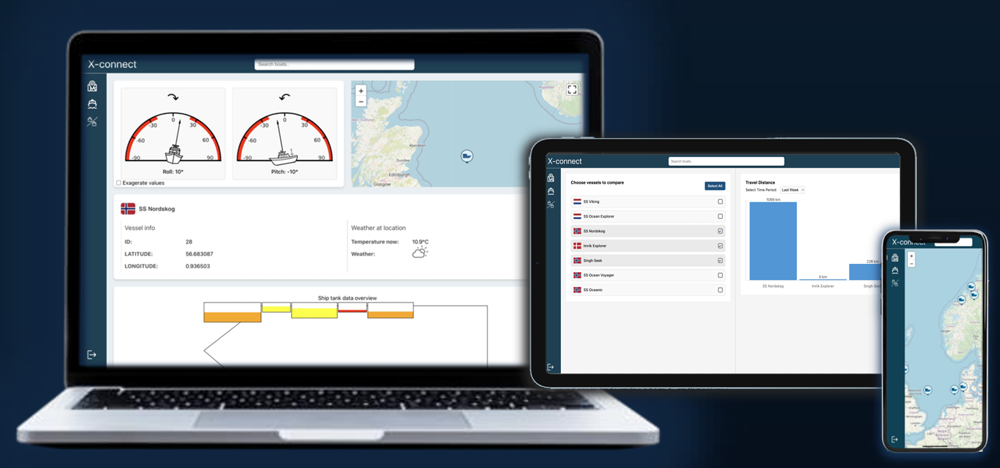
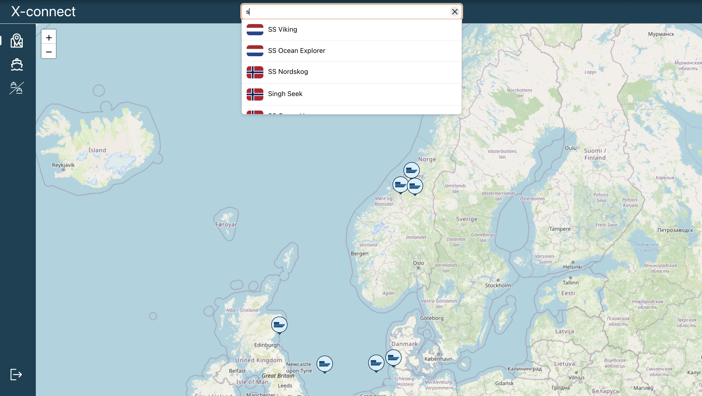
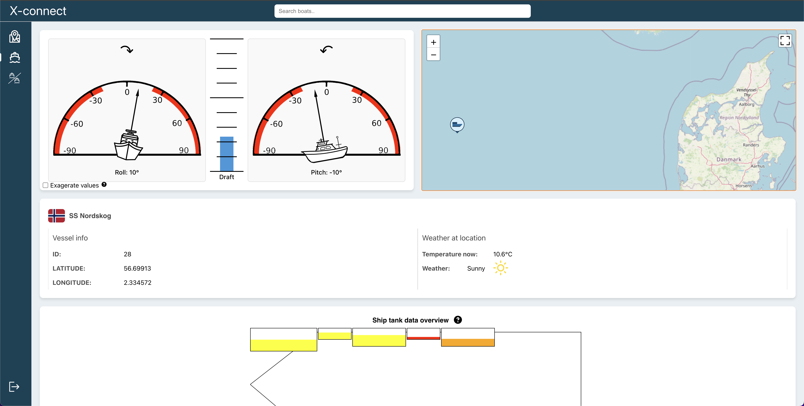
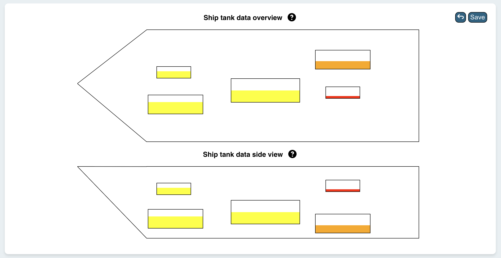
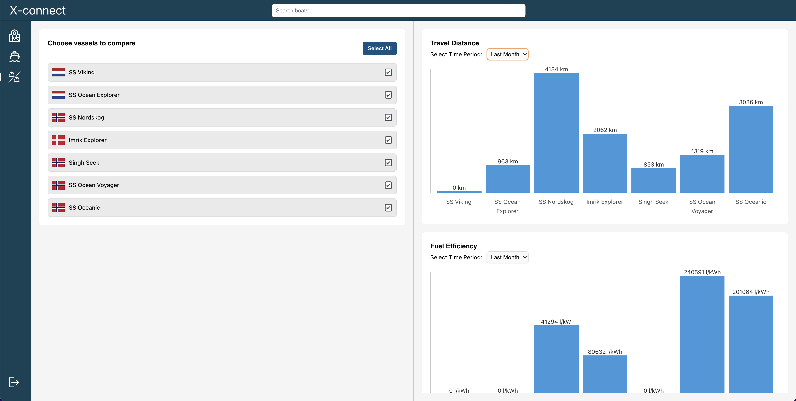

# client

This template should help get you started developing with Vue 2 in Vite.

## About

This is a website to help visualization of boat roll, pitch, draft and fuel levels for different vessels for BlueCTRL.

# Disclaimer
The data used in this README about vessels is purely dummy data. No real data about the vessels is disclosed.

# Some images of the website

## General view on multiple platforms


## Map


## Vessel's position in the water


## Tanks


## Compare


## Recommended IDE Setup

[VSCode](https://code.visualstudio.com/) + [Volar](https://marketplace.visualstudio.com/items?itemName=Vue.volar) (and disable Vetur) + [TypeScript Vue Plugin (Volar)](https://marketplace.visualstudio.com/items?itemName=Vue.vscode-typescript-vue-plugin).

## Customize configuration

See [Vite Configuration Reference](https://vitejs.dev/config/).

## Project Setup

```sh
npm install
```

### Compile and Hot-Reload for Development

```sh
npm run dev
```

### Compile and Minify for Production

```sh
npm run build
```
